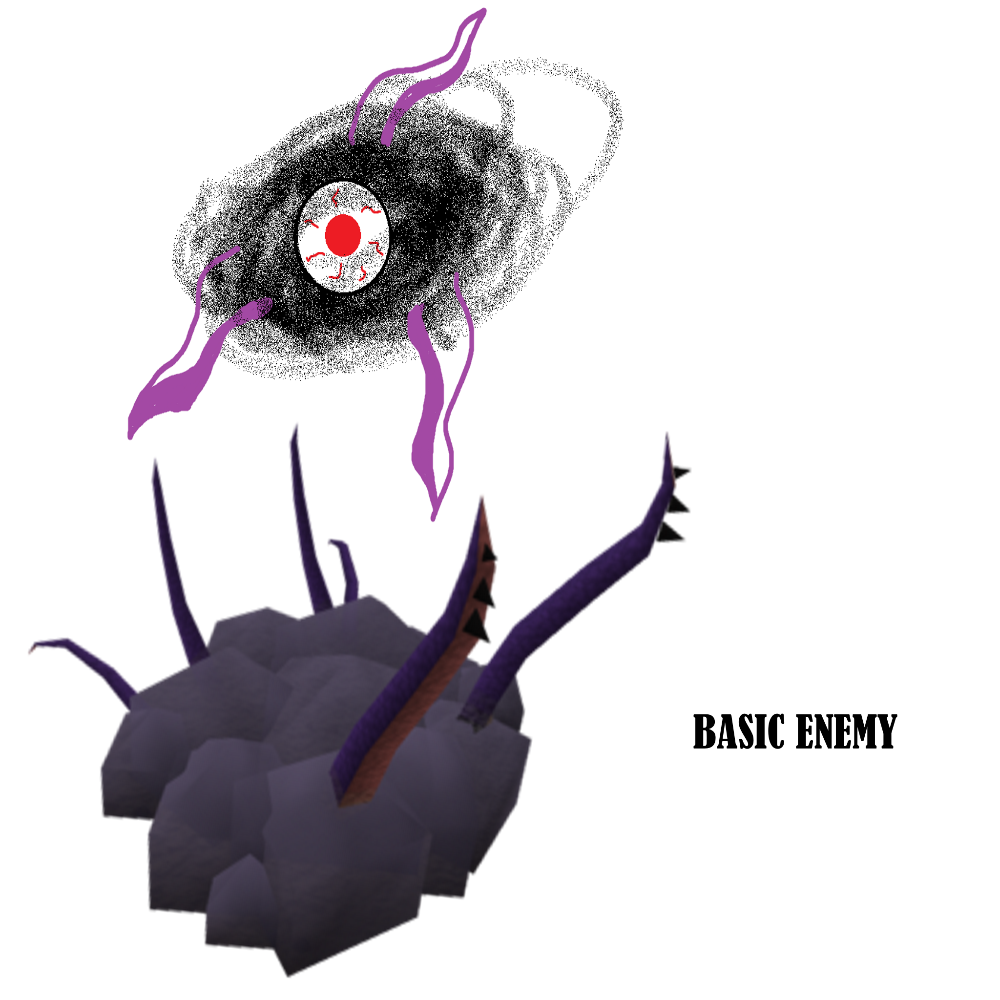

## Game Design Document

# Table of Contents

- [Table of Contents](#table-of-contents)
- [Summary](#summary)
	- [Distinguishing Features](#distinguishing-features)
	- [MVP](#mvp)
- [Story](#story)
	- [Enemies](#enemies)
	- [Setting](#setting)
	- [Narrative](#narrative)
	- [Story summary](#story-summary)
- [Gameplay](#gameplay)
	- [Design Pillars](#design-pillars)
	- [Combat](#combat)
	- [Skills](#skills)
		- [Skill Pool : “Warrior”](#skill-pool--warrior)
		- [Skill Pool : “Rogue”](#skill-pool--rogue)
		- [Skill pool : “Make”](#skill-pool--make)
		- [LS](#ls)
		- [Dagger](#dagger)
		- [Staff](#staff)
	- [Status Effects](#status-effects)
	- [Core Loop](#core-loop)
	- [Mechanics & Dynamics](#mechanics--dynamics)
	- [Core Diagram](#core-diagram)
- [Levels](#levels)
	- [Level Progression](#level-progression)
	- [Environments](#environments)
	- [Level Design](#level-design)
- [Art](#art)
	- [Summary](#summary-1)
	- [Art Bible](#art-bible)
- [UI, Systems & Options](#ui-systems--options)
	- [UI Overview](#ui-overview)
	- [Menu System](#menu-system)
	- [Controls](#controls)
	- [Accessibility](#accessibility)
- [Audio](#audio)
- [Analysis](#analysis)
	- [Market Analysis](#market-analysis)
	- [Competitor Analysis](#competitor-analysis)
	- [Technical Analysis](#technical-analysis)
	- [Legal Analysis](#legal-analysis)
- [Target](#target)
	- [Target Audience](#target-audience)
	- [Target Device](#target-device)
	- [Target Budget](#target-budget)
- [Marketing](#marketing)
	- [Trailer](#trailer)
- [Development Plan](#development-plan)

# Summary

3D rogue-lite action RPG with the rogue-lite elements of Gunfire Reborn/Hades, multiclassing progress of Dungeons & Dragons and the combat of the Witcher 3 /Souls series/Genshin Impact.

## Distinguishing Features

*   Graphics with cel-shading
*   Multi-class gameplay
*   Rogue-lite with action combat and over the shoulder camera
*   Story combining different mythoi

## MVP

*   Core gameplay loop can be played through (New Game -> Select class -> Beat level). 
*   3 skillpools with unique, class based skills
*   Classes use the same base model. 
*   1 level with boss fight. 10 artifacts with status effects. 
*   1-2 enemies (melee, ranged). 
*   6 different rooms + boss room. 
*   Basic UI and menu. Feat system. 
*   Two soundtracks, ambient and boss music, in-game sound SFX.

# Story

## Enemies

Inspiration for the enemies comes from some mythologies like Lovecraftian ones. At the end of the level there will be a boss enemy that will have harder mechanics than a normal enemy and will also offer greater rewards when defeated.

## Setting

WIP map of the Continent. Very likely to have some changes in the future.

The Continent used to be full of lush pine and leaf forests, but as the calamities of the ancient evil devastated the landscape, only a few forests were left standing. Now half of the Continent is under permafrost and another quarter is a hostile desert. Only some brave people live in those areas. The coastline of the Continent is very fractured and there’s a huge amount of island of various sizes near the coast. Two long and wide rivers cut the Continent in three vastly different regions.

The original habitants of the Continent now live in smaller settlements away from humans and have formed anti-human resistance groups to fight the empire humans have now formed. Humans live in bigger settlements, keeps and in their big capital city that is found near the Ruin just across the water.

The Ruin that is now the starting place of all the calamities and ancient monsters is located near the biggest mountain range and the largest lake of the Continent. Nobody knows how deep the dungeons and caverns of the Ruin go.

## Narrative

Human desire for exploration led them to the Continent. Barren wastelands and luscious forests, that is what the humans saw, nothing too interesting. All of that changed when they set their foot in one of the local settlements. Those settlements were few and far between, but their inhabitants caught the eyes of the humans. Multiple humanoid races living in peace and serenity. Yet that was not what got humans interested in them. It was the magical abilities the locals had that humans intrigued.

Human desire for power led the inhabitants of the Continent to be enslaved by the humans. Of course, those magical powers had to be harnessed for the “betterment” of humanity. Soon most of the bigger settlements were turned into human cities. All that magic was used to collect more resources and to build bigger, vainglorious monuments to show the greatness of the humans. Nothing seemed to be enough for the humans.

Human desire for riches was about to lead to the demise of the Continent. The greed eventually brought the humans to the ancient capital of the Continent that was now in ruins. A new capital was quickly built across the river to exploit all the artifacts of the ruins and the ores of the mountainous area. Little did the humans know that the reason why the Continent was barren was about to be unveiled to them. The skeletons deeper in the Ruin should have been enough of a warning.

After months of spelunking and treasure hunting, a magical barrier was found deep in the Ruin. Magic was needed to open this barrier. Every person with magical abilities that was brought to the barrier and did not help opening it, was brutally executed on the spot. Humans were warned about the horrors that would lie beyond that barrier, but the greed was too strong. Eventually the barrier was shattered, all the warnings fell to deaf ears. An ancient eldritch evil was released from its slumber. Most of the people present when the barrier was brought down were instantly killed and the rest were turned into beings that looked like devils with horns and reddish skin.

If anti-human resistance groups had not had a backup plan of this exact scenario, the apocalypse would have been upon the whole world. The resistance groups activated the defense systems their ancestors had built previously when the evil was released. A tower powered by enchanted crystals purified all the water sources and woodlands of the Continent with holy magic. No evil could pass the water and wood lines, this backup plan was not going to last forever though. Answers were needed to stop the apocalypse before it was too late.

Groups and individuals were tasked to venture to the depths of the Ruin to put an end to the calamity. Not all the adventurers were doing it without ulterior motives. Some were motivated by the riches, some by the power promised, some by the adventure itself and some were motivated by the desire to stop the evil.

Lately the beings from the Ruin have been able to pass through parts of the forest and have been terrorizing one of the biggest keeps in the area. If the keep were to  fall all of the ancient creatures are free to wreak havoc around the Continent, it might be too late. Answers and solutions are needed now.

The future of the Continent and likely the whole world now lies in the hands of these adventurers. Will the greed and pride of humans unravel the whole universe, or will there be enough good left to fight back these ancient powers?

## Story summary

Humans exploit the resources and the people of a newfound continent, possibly leading to the end of the world. Humanity’s greed leads them to a ruin which holds in it an ancient eldritch force that will run rampant unless a solution to put it to rest is found quickly. Player character will be one of the people sent to the Ruin to find answers and solutions before it is too late.

# Gameplay

## Design Pillars

**Replayability:** Short enough playthrough time, every playthrough is unique, unlockables.

**Challenge:** Easy to learn, hard to master. Difficulty settings, the player never feels like the game is like a walk in a park

Key mechanics

**Combat:** Combat is fluid, intuitive and dynamic. Different skills and combat styles.

**Visuals:** Appealing art style that fits the world and its various environments. Vibrant world above the ground, dark and grim world under the ground, cel-shading.

**Character progression:** Multiclassing system akin to pen & paper roleplaying games. Different characters with different combat styles and build paths. Multiple feats and skills to open.

## Combat

Basic combat principle:

	Critical chance

	Damage

	Flat Resistance

	Percentual Resistance

	Health

## Skills

### Skill Pool : “Warrior”

	

Skills:

	Whirlwind, damages enemies in a 270 degree arc and knocks them back

    Ultimate Thrust: Charges a mighty thrust that pierces enemies in a line and affects a large area depending on the charge time.

    Stance Change: Changes between Aggressive and Defensive stances

	Shield Bash, evades enemy attacks, gives temporary hit points.

### Skill Pool : “Rogue”

Skills:

    Throw knives in a cone in front of you damaging enemies inside the cone. 

    Causes a bleed effect on the enemies hit.

    Higher crit chance.

Dash through the enemy damaging them. Gain crit chance against the enemies you dash through.

### Skill pool : “Make”

Skills:

    Firestrike area of effect hit that causes enemies to take DoT damage.

    Blizzard area of effect that causes enemies inside it to be slowed down and take damage.

    Short distance teleportation.

Weapons

After choosing your skills, you get to select your weapon to suit your needs out of 3 weapons: Long Sword, Dagger and Staff.

### LS

Type: Melee

Damage: TBD 
Attack speed: 100

Passive: TBD 

### Dagger

Type: Melee

Damage: TBD 
Attack speed: 140

Passive: Increased crit chance

### Staff

Type: Range

Damage: TBD 
Attack speed: 100

Passive: TBD

## Status Effects

 
DoT damage 
Vulnerability (Increased crit chance)

Slow movement

Reduced flat reduction

## Core Loop

Start a run, choose 3 skills, choose a weapon, defeat the enemies to upgrade your skills and collect artifacts, beat the level by defeating the final boss and use gained xp to get new feats, start a new run...

## Mechanics & Dynamics

**Basic attack:** Basic attack is the quick versatile always available combat mechanic for beating the poor creatures that end up between you and the exit to the next stage. It includes a simple attack combo that depends on the weapon you have equipped. Basic attack combos include animations, area of effect, range, damage, length of combo and other special effects caused by the attacks.

**Skills:**. Skills are the primary combat mechanic besides basic attack combos. Skill includes animation, area of effect, range, damage and other special effects caused by it.

**Artifacts:** Artifacts are rarities found in the world around the long-forgotten temples and ruins of the olden civilization that you are exploring. They are semi randomly encountered within the world, elite enemies/bosses and secret rooms. Artifacts include rarity, special effects, etc. Example: _Feather of phoenix. Once during the run when the player character dies a large amount of damage is inflicted to enemies around the player and player character is reborn in the middle of it._

**Feats:** Feats are passive abilities changing base stats of the player character from the start of each run. They are unlocked with currency collected over every play through. The currency is used to advance in a varied “feat tree” unlocking these passive traits for future use.

**Ancient tech points/Experience points: ** Currency collected over multiple runs of the game. Whenever a run finishes, is it because of early death or beating the game the player saves this currency to spend on the menu (“Overworld?”) to advance the character in some ways or to unlock more things to appear during gameplay.

**Equipment enhancing: ** A table where you can choose between enhancing your weapon’s damage or your max hit points by a small amount.

**Secret rooms:** Secret rooms are randomly generated secret areas that need to be actively found by the player, they can be hidden by a mossy entrance, a waterfall, secret activated lift or a fake trap. Secret rooms always include something interesting that helps with the playthrough (like an Artifact) and sometimes pieces of lore that can’t be found anywhere else in the game.

## Core Diagram

# Levels

## Level Progression

Pre-created rooms form random generated sequences that form the level in different ways each time. Each room is full of enemies with some randomness sprinkled in. After entering a room, you cannot exit it until you defeat the enemies in the room or whatever challenge you are facing in there. Completing the room will allow you to progress to the next room and after multiple different rooms you will arrive in a room with the boss of the level.

Whetstones/craftsmen/whatever can also be found randomly and they increase the stats of your equipment. Secret rooms are challenge areas that have a chance to have their entrance to spawn in rooms. Completing a secret room will yield the player with a reward like Artifacts.

## Environments

The locations in the game are based on abandoned underground structures and buildings. The period of time when these are built are medieval, but they also have ancient technology embedded in them and have fantasy themes.

## Level Design

Here’s a very rough example of a level/stage. Every closed shape resembles a room that is randomly connected to another room on its exit point. Every room has multiple possible exit and entry points so they can be connected to other rooms in more ways than just one.

# Art

## Summary

Ruin’s art style can probably be summarized in just a couple of words: Cel-shading/toon shading, textures that remind of watercolors and vibrant yet grim world.

Right now Ruin uses RealToon ([Unity Asset Store: RealToon](https://assetstore.unity.com/packages/vfx/shaders/realtoon-65518)) for its cel-shading, but depending on our needs we might be making our own shader for this, changing to another one or just sticking with RealToon as it has been looking good and working well so far.

## Art Bible

# UI, Systems & Options

## UI Overview

## Menu System

*   Main menu
    *   New Game
*   Inventory
    *   Equipment
    *   Artifacts \
	
*   Options
    *   Graphics
        *   Preset (Low, Medium, High)
        *   V-Sync
        *   FPS limit
        *   Bloom
        *   Anti-aliasing
        *   Aspect ratio
        *   Screen resolution \
	
*   Audio
    *   Sounds
        *   Music volume
        *   SFX volume

## Controls

Ruin is playable with mouse and keyboard as well as a controller. Remapping the keys and controls is possible. You can change the sensitivity of the mouse or the controller. The default mappings are going to be similar to other action RPGs, WASD to move, shift to run, left click to attack for example.

## Accessibility

Remappable controls, mouse/controller sensitivity settings and controller support already help a lot of players. Option to turn off motion blur and other settings like flashing effects is important as well. Changing field of view is also possible. Game’s instructions are clear and there will be tooltips on the loading screen for extra tips.

If possible, we should use Unity’s colordblind filter to see how colorblind friendly our game is.

# Audio

Ruin will have adaptive audio that will be made by using FMOD. Music for the game will be made by using Reaper and multiple different VST plugins and effects. Ruin will have 2 different music tracks. One for the normal stages of the game that adapts between battle and non-battle sections. Boss stage will have a music track that will adapt according to the boss’ phases. In game sounds will be implemented through FMOD as well. Possible voice acted dialogue for the main character.

# Analysis

## Market Analysis

## Competitor Analysis

**Current titles:** 

[Hades](https://store.steampowered.com/app/1145360/Hades/) is a critically acclaimed action roguelike that has been nominated in The Game Awards in multiple categories, including game of the year.

[Noita](https://store.steampowered.com/app/881100/Noita/)  is a Finnish action roguelite with focus on magic and physics. It has received great reviews on Steam.

[Gunfire Reborn](https://store.steampowered.com/app/1217060/Gunfire_Reborn/)  is an FPS roguelite with RPG elements like different abilities and heroes, also cel-shaded voxel graphics. The game is in Steam Early Access and has received very positive reviews.

[Genshin Impact](https://genshin.mihoyo.com/en)  is an open world action RPG with cel-shaded graphics and vibrant colors. It has a character based combat system with every character having a different element and skillset. The game made 245 million dollars during its first month.

Future titles:

[Darkest Dungeon 2](https://www.epicgames.com/store/en-US/product/darkest-dungeon-2/home)  is an upcoming roguelike RPG set in a dark and gritty world. The first game in the series sold over 2 million copies during its first year.

[Senua’s Saga: Hellblade 2](https://www.xbox.com/en-US/games/senuas-saga-hellblade-II)  is an action adventure game that takes place in a grim world with psychological elements. The first title in the series generated over 13 million dollars in revenue and peaked the interest of Xbox Game Studios that later acquired the developer Ninja Theory.

[Boyfriend Dungeon](https://store.steampowered.com/app/674930/Boyfriend_Dungeon/) is a unique take on the hack-and-slash dungeon crawler genre. The game combines two entirely different game genres, dungeon crawler and dating sim, creating “shack-and-slash”. The title has vibrant cartoonish graphics.

[Diablo 4](https://diablo4.blizzard.com/en-us/) is an upcoming entry in the legendary Blizzard dungeon crawler series. Fans have been waiting for this game for years but right now it doesn’t have a set release date.

## Technical Analysis

## Legal Analysis

# Target

## Target Audience

## Target Device

The game will be distributed on PC platform.

## Target Budget

# Marketing

## Trailer

# Development Plan

We will be using **Unity 2019.4.18f1 LTS **version. 
